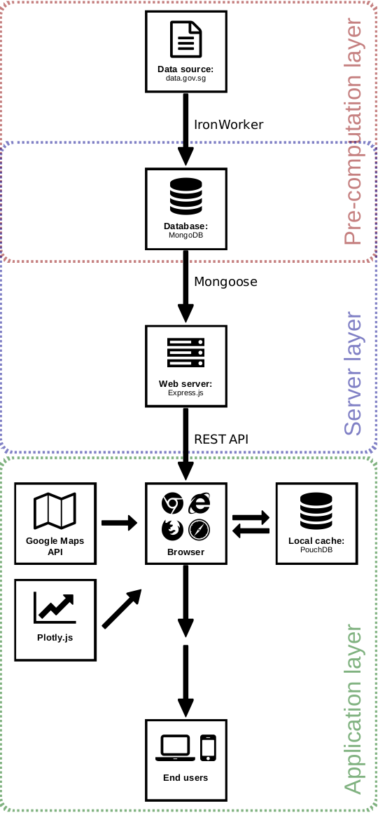

# Visualization of HDB Resale Market

 

#### Deployed at: [https://hdbresale.daburu.xyz](https://hdbresale.daburu.xyz)

## Introduction

I built this web visualization as my second project for General Assembly's Web Development Immersive.

Together with [Albert Salim](https://github.com/caalberts), we took a public dataset, the [HDB Resale Flat Prices](https://data.gov.sg/dataset/resale-flat-prices), and made use of web technologies to present data in the most intuitive and accessible manner for the public to better understand trends in the HDB resale market. We design our app for the user to explore data from 2 perspectives: time and space. Data is presented in the form of:
 1. A time series chart showing historical price trends, and
 2. A heat map showing the hottest locations for HDB resale in Singapore.

## Building the application

Detailed instruction for how to use the app can be found in the **About** section of the app. I will use this space instead to elaborate on the technical aspects of building this app.

Below is an overview of the tools and frameworks used in our application stack:

Our application stack is broken down to 3 layers:

1. Pre-computation layer
2. Server layer
3. Application layer

Its design focused a lot on accessibility and usability. User should be able to access the data from any platform, begin explore without any instruction, easily find the information they need, and should not have to wait too long for data to be retrieved, processed and presented.

To achieve these goals, we incorporated useful design features like **pre-computation**, **browser-side caching**, **3rd-party APIs** and **responsive layout**.

### Pre-computation

The source data.gov.sg dataset consists of 3 separate tables which have to be retrieved with 3 separate API calls. The 3 tables are then joined together to get a 300,000 rows table from which we have collect summary statistics like min, max, median, mean for each month, town and flat-type.

To construct the heatmap, we also need to convert addresses to latitude and longitude thus have to make separate API calls to Google Maps. All these cannot be done live without severely affecting usability.

Our solution: add a pre-computation layer to our backend. Data is fetched weekly from data.gov.sg, processed in the background, then stored in **MongoDB**. This is done through a scheduled **IronWorker**. Our server only access the pre-computed data in MongoDB thus significantly reduces latency.

### Browser-side caching
Even with pre-computation, because MongoDB stores data in a distributed cluster, retrieving data still adds one or two seconds latency. This is not ideal if user wants to quickly switch between different views (eg. Bedok > Tampines > Bedok).

In this case, our solution is to implement browser-side caching using **PouchDB**. Every time user toggles a new view (eg. Bedok to Tampines), browser will search for a local cache of the data corresponding to that view. If not found, an API call will be made to the **Express server**.

One more case is if data exists but not the most up to date (remember pre-computed database is updated every once a week). When encountered, browser will first serve the outdated local data while asynchronously fetching the new data (from server) then update the view in place so user will perceive the data loading.

Finally, if browser is fetching data from server and user toggle to another view (eg. 2015-06 > 2015-07 > 2015-08 > 2015-09), browser will only render the last called data (2015-09) skipping through the in-between views (2015-07 & 2015-08). Though not rendered, data fetched of the in-between views are nevertheless entered into the local cache to be called out in future.

### 3rd-party APIs
We relied on 3rd party APIs like **Plotly graphing library** and **Google Maps** for data visualization. Reason is so we do not need to concern ourselves too much with the nitty-gritty aspects of data plotting and user interactions. Basic interaction like pan and zoom are handled automatically by the 3rd party APIs and we only need to focus on building high level features such as click events specific tp data point (eg. when user click on a data point in the time-series, we will retrieve all the transactions associated with that data point).

### Responsive layouts
We also incorporated responsive layout design such as:
- Top navigation bar automatically collapse to two rows on a mobile screen in portrait mode.
- Table of transaction records appears differently in portrait versus landscape mode.

Thank you for getting this far in the README. Do check out these features when you explore our [app](https://hdbresale.daburu.xyz/). Hope you'll find our app useful and informative.

## Contributors
- Thong Yong Jun - @yongjun21
- Albert Salim - @caalberts

<!-- ## API

[API documentation](http://docs.hdbflats.apiary.io/) -->
