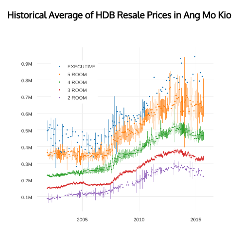
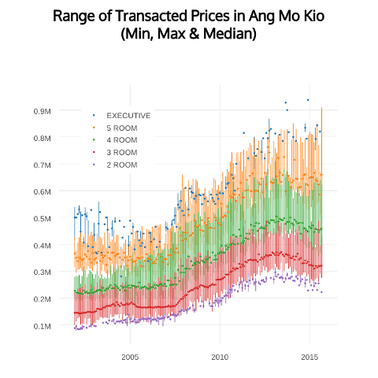

### About this Project

With Singapore rolling out its [Smart Nation Vision ](https://www.ida.gov.sg/Tech-Scene-News/Smart-Nation-Vision)  and the recent launch of IDA's new [open data portal](https://data.gov.sg/), budding web developers [Albert Salim](https://github.com/caalberts) & [Yong Jun](https://github.com/yongjun21) embarked on building their first data visualization project. This project was a fruitful leaning experience for the two and final product can be described as one perfect marriage between **Web** and **Data**.

Our love story begins with **Mr Data**. He leads a simple uninspired existence inside some data warehouses used by government agencies to house thousands of others bachelor dataset leading similar simple uninspired existence. His real name is the [HDB Resale Flat Prices](https://data.gov.sg/dataset/resale-flat-prices) dataset:

Records of resale flats transacted prices all the way back to 2001, classified by towns & flat types and supplemented with information like address, storey range, floor area & remaining lease. What those numbers are good for? He never knew and had long resigned to the fact that he's just another worthless piece of Excel sheet, not unlike his younger cousin, the HDB Annual Report.

That was until one day his friend dragged him to the biggest bachelor party in town, the *IDA Open Data Initiative*. There he met the girl of his dream: **Ms Web**. She taught him how to be presentable: like plotting historical averages and price range on a chart to highlight long term trend. Or using heat map to show clusters of transactions co-located geographically. He was transformed, literally.

Besides making **Mr Data** a better ~~man~~ data, **Ms Web** does have a few tricks of her own: like thoughtful user experience design and responsive layout. But this is made possible only because the rich meaningful content provided for by **Mr Data**.

 **Mr Data** is very touched by what **Ms Web** did for him. So on their 1 month anniversary, he popped the question: **"Dear, is it time we buy a HDB flat?"**

 ### How to use?

 #### Charts Tab
 <!-- Build a div replica of the Charts tab here-->
 
 
 <!-- Use display: inline-block for the two screenshots-->

The **Charts** tab opens a time-series chart of historical resale prices . User can toggle between two modes: **Average** & **Min, Max & Median**. User chooses the **town** and returned chart is a set of time-series broken down by **flat types**.

##### Average
Markers represent average transaction price in that month while the error bars represent the uncertainty around this average value based on the number of data points available. To calculate this uncertainty, we used 95% t-confidence interval.

##### Min, Max & Median
Markers represent median transaction price while top and bottom error bars connect median price respectively to the highest and lowest transacted prices.

#### Maps Tab
 <!-- Build a div replica of the Maps tab here-->

The **Maps** tab opens a geographical heat map of resale transactions organized by month. Red spots indicates areas where there's either *1)* a concentration of transactions or *2)* existence of data points with higher than average transaction prices.

To select a particular month, either use the drop down or click on the point left and point right buttons on the sides to scroll to previous month or next month.

The heat map is layered over Google map so user can use standard navigation options like pan and pinch-zoom to explore. Clicking on the button at the bottom will re-center the map.
